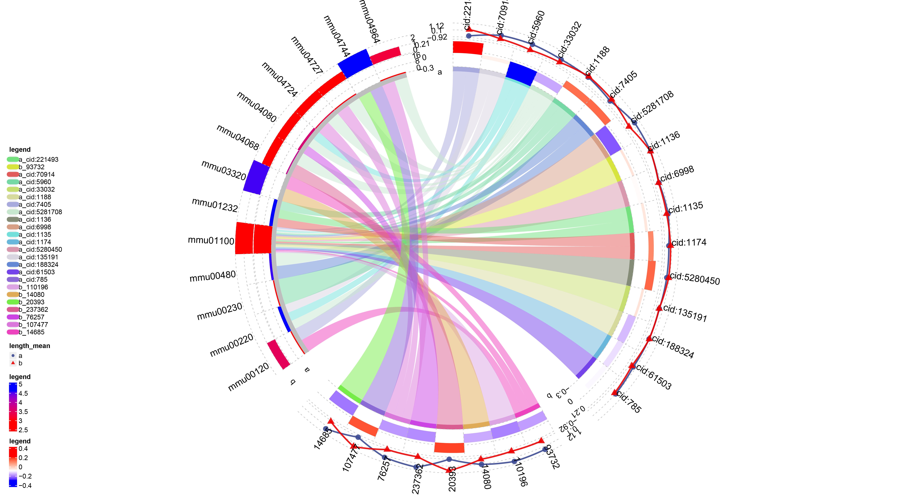
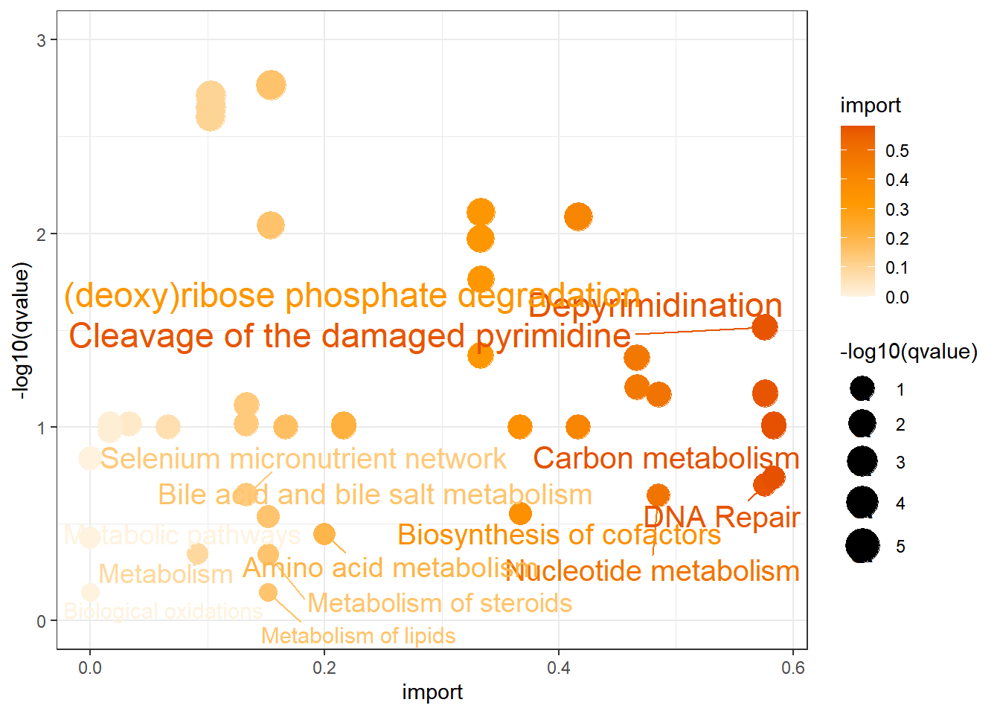
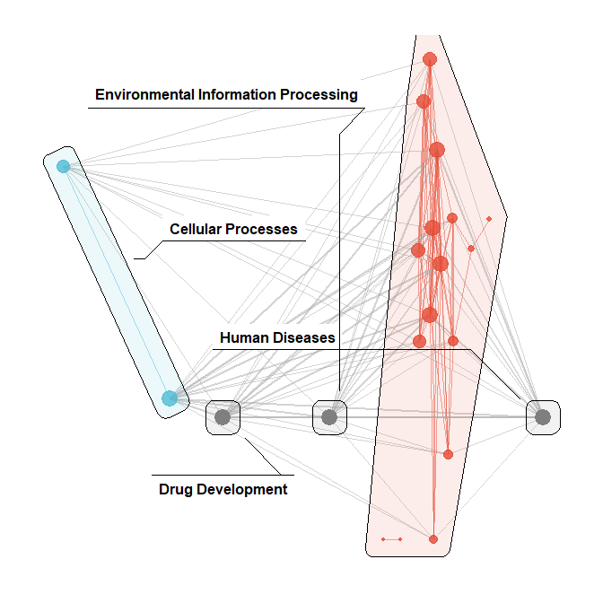
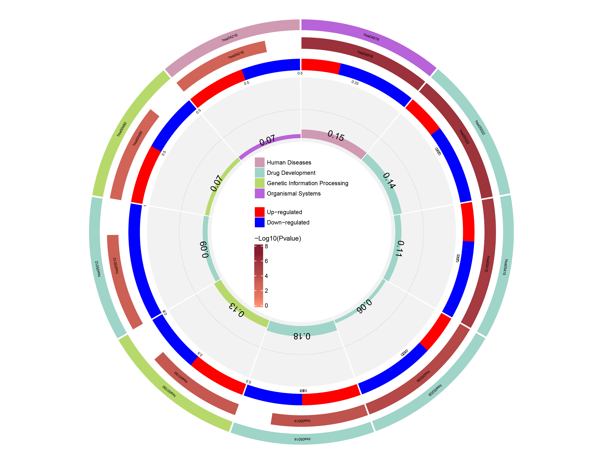

# pathways
easy to analy pathways

Pathways integrates enrichment analysis algorithms, databases and visualizations. It currently includes 13 databases, 2 enrichment analysis algorithms, design flounder diagrams, integrated enrichment analysis circle diagrams, functional classification diagrams, etc. Save the results in metaProfiler format. In addition, the package is based on low-level graph functions, Professor Yu Guangchuang's visual enrichment analysis results and joint multi-omics analysis (metabolism, transcriptome, protein, enzyme) to visualize the associations between datasets to mine the correlation between multi-omics potential connection.


You'll still need to render `README.Rmd` regularly, to keep `README.md`
up-to-date. `devtools::build_readme()` is handy for this. You could also
use GitHub Actions to re-render `README.Rmd` every time you push. An
example workflow can be found here:
<https://github.com/r-lib/actions/tree/v1/examples>.


＃ 基本的设计

```
easy.clusterProfiler()
pathways_analy()
plot_chor()
plot_circos()
plot_funmap()
kegg_pathway1()

```


您还可以嵌入绘图，例如：
# analy
``` r
#devtools::install_github("wdb-web/pathways")
library(clusterProfiler)
library(pathways)
library(tidyverse)
library(igraph)
library(ggraph)

x<-readxl::read_xlsx(system.file("data", "Col-top50.xlsx", package = "pathways"))
y<-readxl::read_xlsx(system.file("data", "metadata.xlsx", package = "pathways"))%>% as.data.frame()%>% na.omit
rownames(y)<-y$Sample%>%str_extract_all("[0-9]+[0-9]")%>% unlist %>% paste("cid:",., sep = "")
y[,-1]->y
library(biomaRt)
mart <- useMart("ensembl","mmusculus_gene_ensembl")
gene_name<-getBM(attributes=c("ensembl_gene_id","entrezgene_id"),
                 filters = "ensembl_gene_id",values = x$Gene, mart = mart)
inner_join(gene_name,x,by=c("ensembl_gene_id"="Gene"))%>% na.omit->getkegg
getkegg$ensembl_gene_id[!is.na(getkegg$entrezgene_id)]<-getkegg$entrezgene_id[!is.na(getkegg$entrezgene_id)]
getkegg[,-2]->genes
rownames(genes)<-genes$ensembl_gene_id
genes[,-1]->genes
group<-c(rep("A",4),rep("B",5))
list(a=y%>%t%>%as.data.frame(),b=genes%>%t%>%as.data.frame())->data
data%>% setNames(c("a","b"))->data
names<-match(data[[1]]%>% rownames,data[[2]]%>% rownames)
data[[2]]<-data[[2]][names,]
pathways_analy(data = data,group = group,org = "10090",scale = T,import_model=c("degree"))->n

```


``` r
# system.file("data", "Tes.RData", package = "pathways")
# kegg_pathway1(data=c("cid:5997","cid:65094","cid:5280335"))->da
# kegg_pathway1(data=c("P0DTD3","Q9BYF1","Q9NRS4","Q9NYK1"))->da
# kegg_pathway1(data=c("3.4.22.15","3.4.22.69","3.6.4.12","3.6.4.13"))->da
# kegg_pathway1(c("6921","6923","8453","8883","9039","9978","79699"))->da
# kegg_pathway1(a=c("6921","6923","8453","8883","9039","9978","79699"),b=c("P0DTD3","Q9BYF1","Q9NRS4","Q9NYK1"))->da
# n@data$a[1,]%>%c%>%unlist%>%abs->data2
# gsea<-GESA(data=data2,org="10090")
```


# big circos
``` r
# load(system.file('data', 'Tes.Rdata',package = 'pathways'))
n@kegg_analyst$compareClusterResult %>%
    clusterProfiler::filter(Description %in% c((n@kegg_analyst$compareClusterResult %>%
        group_by(Description) %>%
        summarise(n = n() > 1)) %>%
        dplyr::filter(n == T) %>%
        .$Description) | qvalue < 0.05) %>%
    as.data.frame() -> f
circos.clear()
circos.par(cell.padding = c(0, 0, 0, 0), points.overflow.warning = FALSE, start.degree = 90)
plot_chor(f, metaProfiler = n) -> v
# looking for
# ComplexHeatmap[https://jokergoo.github.io/ComplexHeatmap-reference/book/legends.html]
pd = packLegend(list = v)
draw(pd, x = unit(1, "cm"), y = unit(1, "cm"), just = c("left", "bottom"))
```



In that case, don't forget to commit and push the resulting figure
files, so they display on GitHub and CRAN.


``` r
comp_dotplot(n@kegg_analyst$enrichKEGG$a)
```



# funmap
``` r
n@kegg_analyst$enrichKEGG$a@result%>% dplyr::filter(org=="KEGG") ->y
n@kegg_analyst$enrichKEGG$d@result->d23
plot_funmap(d23)
```



# easy to clusterProfiler
``` r
easy.clusterProfiler(n@kegg_analyst$enrichKEGG$a@result)
```


# circos

``` r
library(tidyverse)
library(data.table)
library(clusterProfiler)
load("pathways.RData")
comp_dotplot(da@kegg_analyst$enrichKEGG$a)
da->lllll
lllll->da
 da@kegg_analyst$enrichKEGG$a@result%>% dplyr::filter(org=="KEGG") ->y
library(randomcoloR)
library(circlize)
library(ComplexHeatmap)
FC<-c(0.5,1.2,0.4,0.1,2)  # add FC 
names(FC)<-y$geneID%>%unlist%>% str_split("/")%>%unlist %>%unique #FC names
plot_circos(y,FC) # is a clusterProfiler@result data

```




# enrichplot

``` r
 clusterProfiler::dotplot(n@kegg_analyst$enrichKEGG$a)
```


``` r
enrichplot::emapplot(enrichplot::pairwise_termsim(n@kegg_analyst$compareClusterResult))
```


